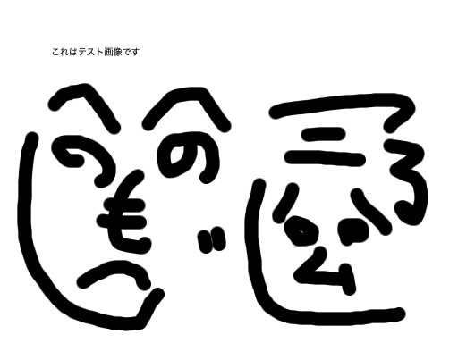

# サンプル
これはサンプルです。
マニュアル用マークダウンのテストです。

## 強制改行
強制改行には2個以上の空白文字だけの行を置く。
  
1個だけの空白文字は空行扱い。
 
確認行。

## 強調
これは*強調された文字列*です。
もっと__強調された文字列__です。
一番***強調された文字列***です。

## 画像はどうかな？
画像を表示。
 


## CSVテーブル
```@csv:th_row
a,b,c
d,e,f
CSV,テーブル,サンプル
```

## CSVテーブル2
@csv:th_col(test.csv)

## マークダウンのテーブル
|魚      |頭足類|貝      |
|:------:|:----:|:------:|
|タイ    |タコ  |ホタテ  |
|マグロ  |イカ  |アサリ  |
|カンパチ|      |ハマグリ|

## 注意書きと注釈
### 注意書き
```@box:notice[ほげほげに注意]
注意書きです。
かいぎょうもできる。
```

### 注釈
```@box:info[これは注釈]
注釈の本文。
２行目
```

## リスト
### ul
- あああ
- いいい
- ううう

### ol
1. あああ
2. いいい
3. ううう

### 複雑なリスト
- 1項目目
  何か説明・・・
  1. 1項目目の1
  1. 1項目目の2
- 2項目目
  何か説明・・・
  1. 2項目目の1
  1. 2項目目の2

## コードブロック
コードブロック。
```
#include <stdio.h>

int main(void){
	printf("Hello World\n");
}
```
## インラインコード
これは```インラインコード```です。

## 引用
> これは引用
> 2行目
>> 二重の引用
>> 二重の引用続き

## 横線
------
-- -- --
______
_ _ _ _ _
*******
* * * * *